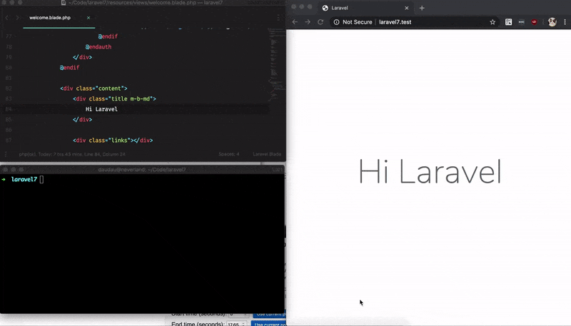

# Laravel LiveReload

This package integrates into default `artisan serve` command an WebSockets server for live reloading the application when any file changed.



## Installation

`composer require attla/laravel-livereload --dev`

## Usage

Open terminal and run `php artisan serve`

This package works even when you use custom vhost such as `valet` or `laragon`

## Configuration

By default, this package looking for files changes in these directories:

```
/app
/public 
/config 
/routes 
/resources
```

If you want to customize the watched forlders, you can publish the configuration file by this commmand:

```bash
php artisan vendor:publish --provider="Attla\LiveReload\CommandServiceProvider"
```

and then you can config what you want in the `config/livereload.php`.

## License

This package is licensed under the [MIT license](LICENSE) © [Octha](https://octha.com).
